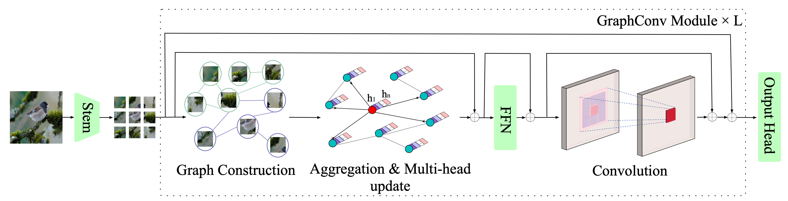
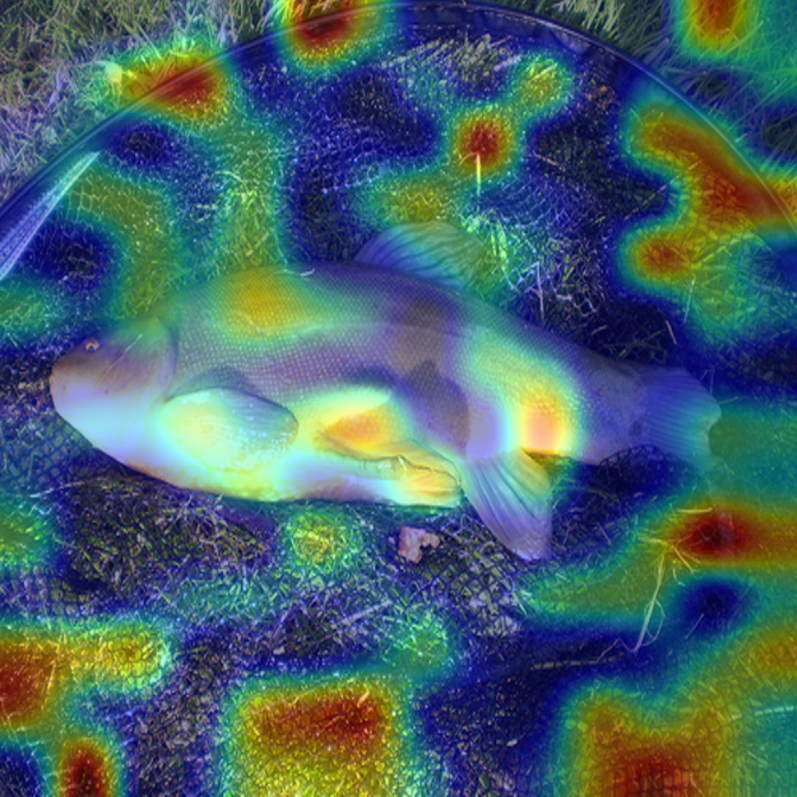
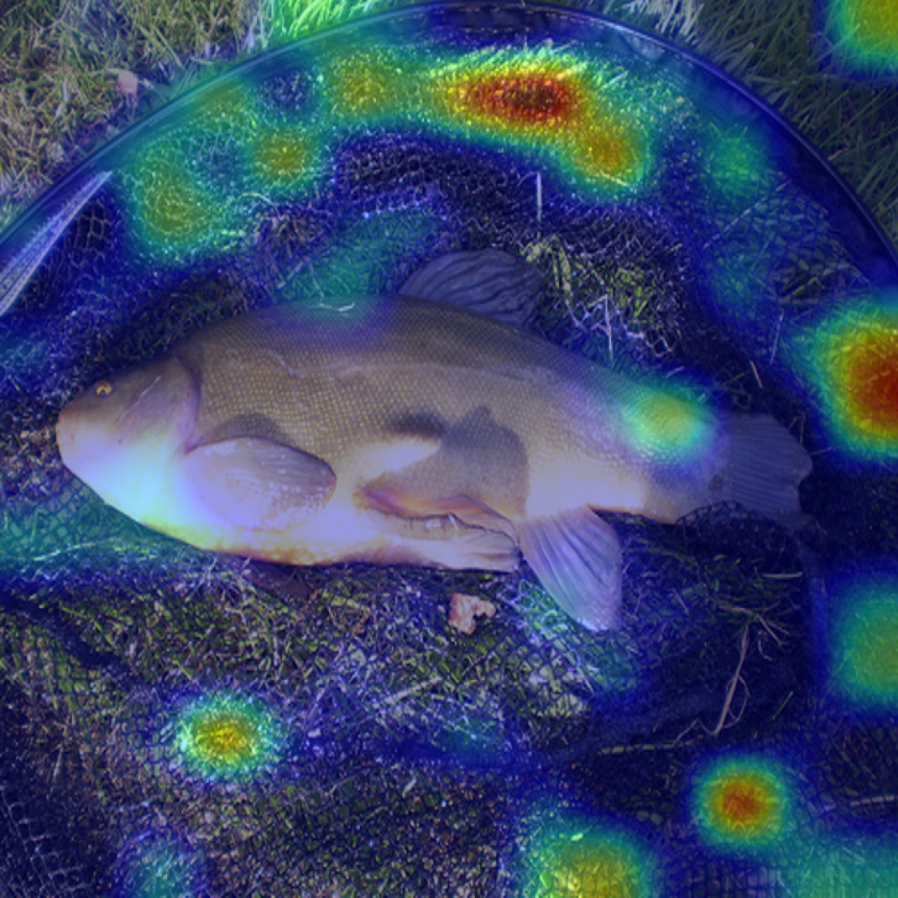
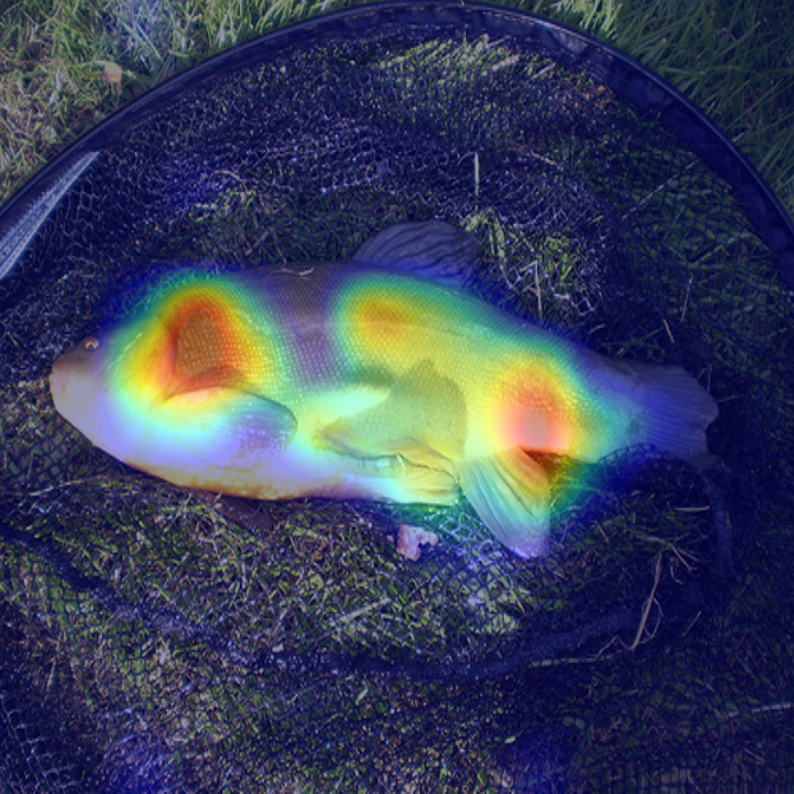
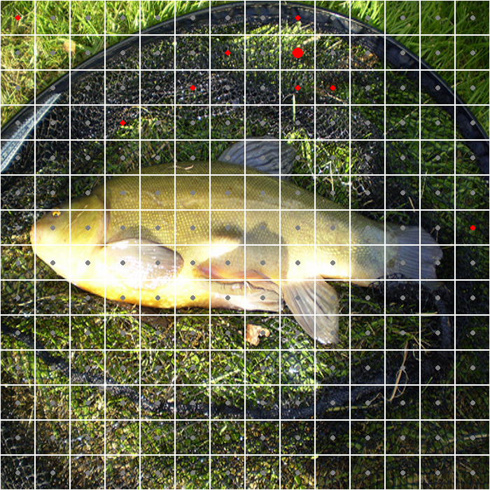

## GraphConvNet
**Hierarchical Convolution and Graph Net for Utilizing Structural Information of Image**

## Requirements

Pytorch 1.7.0,
timm 0.3.2,
torchprofile 0.0.4,
apex

## Pretrained models on ImageNet

- GraphConvNet

| Model            | Params (M) | FLOPs (B) | Top-1 | BaiduDisk URL                                                |
|------------------|------------|-----------|-------| ------------------------------------------------------------ |
| GraphConvNet-Ti  | 7.7        | 1.3       | 77.1  | [BaiduDisk URL](https://pan.baidu.com/s/1_yCwQnPhneGnho6AaT-cBw?pwd=5eri) |
| GraphConvNet-S   | 24.5       | 4.9       | 82.0  | [BaiduDisk URL](https://pan.baidu.com/s/1EBXv987qj9p5X5_OtCOcDA?pwd=hji9) |

- Pyramid GraphConvNet

| Model                   | Params (M) | FLOPs (B) | Top-1 | BaiduDisk URL                                                             |
|-------------------------|------------|-----------|-------|---------------------------------------------------------------------------|
| Pyramid GraphConvNet-Ti | 11.4       | 1.8       | 80.5  | [BaiduDisk URL](https://pan.baidu.com/s/1nYOAoe8R3jf4KMjIWw-KAA?pwd=tmsb) |
| Pyramid GraphConvNet-S  | 29.2       | 4.9       | 82.4  | [BaiduDisk URL](https://pan.baidu.com/s/1KJnmqEmqiw17zV64qqNQRw?pwd=tvkv) |

## Train ＆ Evaluation
see  `run.sh`

## Visualization
The visualization code only available to GraphConvNet and ViG
1. **Create a fold named 'ckpt' in './viz_nodes'** and download the checkpoints of  **GraphConvNet-Ti or GraphConvNet-S** and put them in './viz_nodes/ckpt'
2. Open `viz_demo.ipnb`,and set arguments(arch,) 
3. Run cells

   
⚠️⚠️⚠️  if you want to visualize ViG, please download the checkpoints I provide  [here](https://pan.baidu.com/s/1At2NY9wuAC3MH8hqEICRRg?pwd=3qbz), since **I reorganized ViG code** and transformed the official checkpoints' state_dict to suit my code.
   
### Demo
- The first row: gradcam heatmaps of GraphConvNet-Ti in 4th,8th,12th layers.
- The second row: the patch(node) that  has the max gradcam value and its corresponding neighbors in different layers. (you can draw edges using other tools such as  PowerPoint, OmniGraffle..)

## Acknowledgement

This repo partially uses code from [vig](https://github.com/huawei-noah/Efficient-AI-Backbones/tree/master/vig_pytorch)

